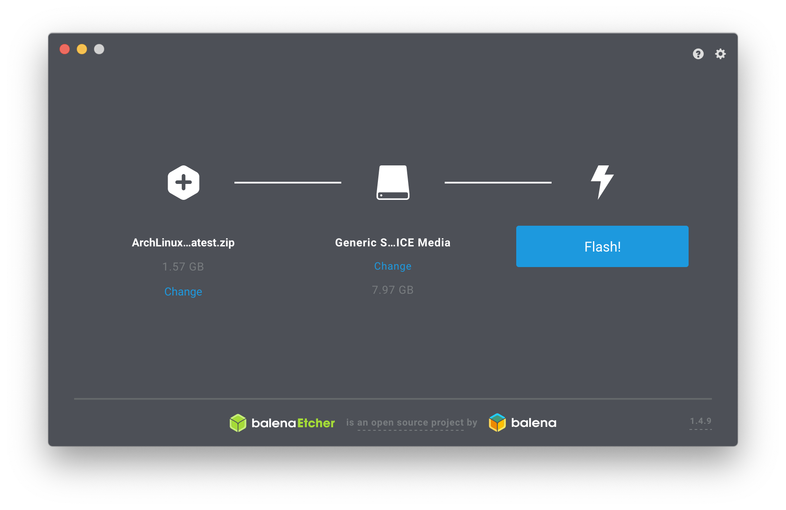

# archlinux-arm-img
[](https://travis-ci.com/bcomnes/archlinux-arm-img)


A simple (unofficial) CI/CD bash script to build a zipped `.img` of [Arch Linux Arm](https://archlinuxarm.org) installation archives, released to [GitHub releases](https://github.com/bcomnes/archlinux-arm-img/releases).

The `alarm` project does not publish images, just inconveniently packaged archives that require a very up-to-date version of  [`bsdtar`](https://www.libarchive.org).

## Usage

You can use this repo in a few different ways:

### Flashing the provided image

1. [Download the image](https://github.com/bcomnes/archlinux-arm-img/releases/latest) and install with the [etcher GUI](https://www.balena.io/etcher/) or something similar:

```console
# on mac
$ brew cask install balenaetcher
```



2. The `/` partition is very small, so you will also need to extend that to fill up your SD card.  You have to do this from an external system, you cannot resize the partition with the system running on the SD card itself. TODO: instructions/resources on how to do that.

3. Continue on [step 9](https://archlinuxarm.org/platforms/armv8/broadcom/raspberry-pi-3) from the relavant intructions where you boot the SD card, log in (user:`alarm` pw:`alarm` root:`root`) and initialize pacman:

```console
pacman-key --init
pacman-key --populate archlinuxarm
```

### Running your own build

The indented usage is to just consume the artifacts published on the [GitHub releases](https://github.com/bcomnes/archlinux-arm-img/releases) page, but you can also run it locally on linux.

```console
$ git clone https://github.com/bcomnes/archlinux-arm-img.git
$ cd archlinux-arm-img
$ sudo ./build-arch-arm-img.sh http://os.archlinuxarm.org/os/ArchLinuxARM-aarch64-latest.tar.gz
```

The script requires sudo access, because it needs to mount things.  Read the script, it short.

There is also a script to install new `bsdtar`, but its just a simple `./configure ; make ; make install`, so its not recommended to use outside of a disposable environment.  Find a way to install `bsdtar` 3.3.1 or greater with your system package manager.

If you do run your own build, set it up to run in a CI environment. See [.travis.yml](./travis.yml) for example CI usage.

### Customize with packer (experimental)

(Note the following method is still experimental/WIP and doesn't work yet)

Create customized versions of this image with [packer](https://www.packer.io) and [solo-io/packer-builder-arm-image](https://github.com/solo-io/packer-builder-arm-image).

- Install packages
- Resize the image
- Create users
- Set up ssh keys
- etc...

See [github.com/bcomnes/raspi-packer](https://github.com/bcomnes/raspi-packer) for example consumption of this image with packer. (Not functional yet, see [solo-io/packer-builder-arm-image#12](https://github.com/solo-io/packer-builder-arm-image/issues/12))

## Releases

Currently publishing the following installations.  Open a pull request if you would like additional images added or to request a rebuild.  Images are dated when they were created.

- [ArchLinuxARM-rpi-2-latest.tar.gz](https://archlinuxarm.org/platforms/armv8/broadcom/raspberry-pi-3)([rpi2](https://archlinuxarm.org/platforms/armv7/broadcom/raspberry-pi-2))
- [ArchLinuxARM-rpi-3-latest.tar.gz](https://archlinuxarm.org/platforms/armv8/broadcom/raspberry-pi-3)

Run your own builds in CI for a greater level of trust in the build output.

## See also

- [Packer](https://www.packer.io)
- [solo-io/packer-builder-arm-image](https://github.com/solo-io/packer-builder-arm-image)
- [archlinuxarm.org](https://archlinuxarm.org)
- [projects/archlinux-rpi2/](https://sourceforge.net/projects/archlinux-rpi2/) - Similar project, but little transparency around builds
- [gist.github.com/larsch/4ae5499023a3c5e22552](https://gist.github.com/larsch/4ae5499023a3c5e22552) - A gist this workflow was based on
- [etcher GUI](https://www.balena.io/etcher/)
